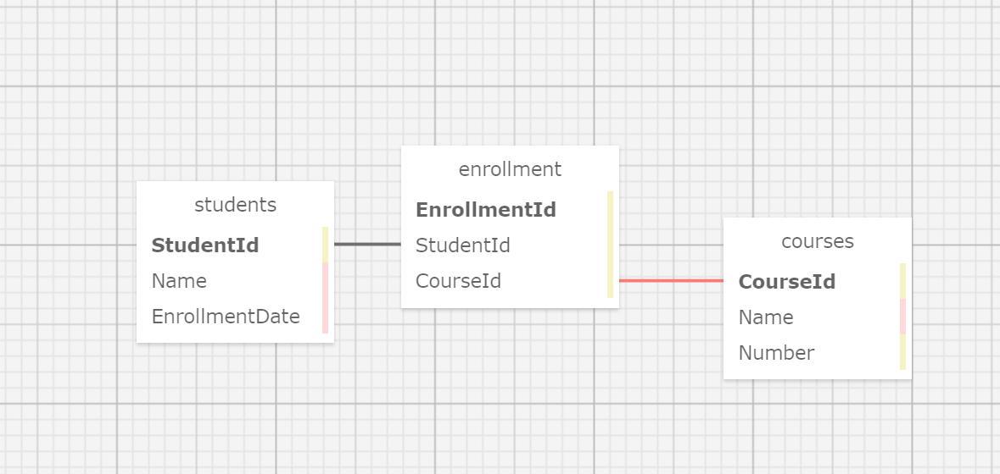

# _University Registrar_

#### _Many to Many Database Relationship Practice for Epicodus_ 
#### _DATE 01.04.2021_

#### By _**Tawnee Harris, Max Brockbank and David Sterry**_

## Description

This application will allow a user to create and organize University Students and Courses using many to many database relationships.

## Setup/Installation Requirements

Software Requirements
* An internet browser of your choice; I prefer Chrome
* A code editor; I prefer VSCode
* .NET Core
* MySQL
* MySQL Workbench

Open by Downloading or Cloning
* Navigate to <https://github.com/tawneeh/UniversityRegistrar.Solution.git>
* Download this repository to your computer by clicking the green Code button and 'Download Zip'
* Or clone the repository

AppSettings
* This project requires an AppSettings file. Create your `appsettings.json` file in the main `UniversityTracker` directory. 
* Format your `appsettings.json` file as follows including your unique password that was created at MySqlWorkbench installation:
```
{
  "ConnectionStrings":{
      "DefaultConnection": "Server=localhost;Port=3306;database=university;uid=root;pwd=<YourPassword>;"
  }
}
```
* Update the Server, Port, and User ID as needed.

Import Database using Entity Framework Core
* Navigate to UniversityRegistrar.Solution/UniversityTracker and type `dotnet ef migrations add <MigrationName>` into the terminal
* Then, type `dotnet ef database update` into the terminal to create your database tables.

DB SQL Schema Snippet
* Paste this Schema Create Statement into your SQL Workbench to create this database and its tables.
```
CREATE DATABASE `university` /*!40100 DEFAULT CHARACTER SET utf8mb4 COLLATE utf8mb4_0900_ai_ci */ /*!80016 DEFAULT ENCRYPTION='N' */;
USE university;
CREATE TABLE `__efmigrationshistory` (
  `MigrationId` varchar(95) NOT NULL,
  `ProductVersion` varchar(32) NOT NULL,
  PRIMARY KEY (`MigrationId`)
) ENGINE=InnoDB DEFAULT CHARSET=utf8mb4 COLLATE=utf8mb4_0900_ai_ci;
CREATE TABLE `courses` (
  `CourseId` int NOT NULL AUTO_INCREMENT,
  `Name` longtext,
  `Number` int NOT NULL,
  PRIMARY KEY (`CourseId`)
) ENGINE=InnoDB AUTO_INCREMENT=4 DEFAULT CHARSET=utf8mb4 COLLATE=utf8mb4_0900_ai_ci;
CREATE TABLE `enrollment` (
  `EnrollmentId` int NOT NULL AUTO_INCREMENT,
  `StudentId` int NOT NULL,
  `CourseId` int NOT NULL,
  PRIMARY KEY (`EnrollmentId`),
  KEY `IX_Enrollment_CourseId` (`CourseId`),
  KEY `IX_Enrollment_StudentId` (`StudentId`),
  CONSTRAINT `FK_Enrollment_Courses_CourseId` FOREIGN KEY (`CourseId`) REFERENCES `courses` (`CourseId`) ON DELETE CASCADE,
  CONSTRAINT `FK_Enrollment_Students_StudentId` FOREIGN KEY (`StudentId`) REFERENCES `students` (`StudentId`) ON DELETE CASCADE
) ENGINE=InnoDB AUTO_INCREMENT=10 DEFAULT CHARSET=utf8mb4 COLLATE=utf8mb4_0900_ai_ci;
CREATE TABLE `students` (
  `StudentId` int NOT NULL AUTO_INCREMENT,
  `Name` longtext,
  `EnrollmentDate` longtext,
  PRIMARY KEY (`StudentId`)
) ENGINE=InnoDB AUTO_INCREMENT=4 DEFAULT CHARSET=utf8mb4 COLLATE=utf8mb4_0900_ai_ci;
```

SQL Database Design
<center>

</center>

Launch this Application
* Navigate to UniversityRegistrar.Solution/UniversityTracker and type `dotnet restore` into the terminal
* Then, in the same project folder, type `dotnet build` into the terminal followed by `dotnet run`
* Peruse this application at your leisure

## Known Bugs

This application has no known bugs. 

## Support and contact details

* Please feel free to reach out to Tawnee anytime at <tawneeh@icloud.com> 
* Or Max Brockbank at <maxbrockbank1999@gmail.com>
* Or David Sterry at <sterry.david@gmail.com>

## Technologies Used

* C#
* Razor
* Entity Framework Core
* MySql
* MySql Workbench

### License

[](https://opensource.org/licenses/MIT)

Copyright (c) 2021 **_Tawnee Harris, Max Brockbank and David Sterry_**